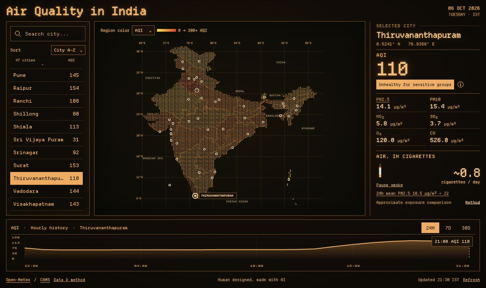

# Air Quality in India

A live air-quality dashboard for 47 Indian cities, including major cities and state capitals. Built with React and Vite, with a Departure Mono interface inspired by [AmberConsole](https://github.com/DutchDiederik/AmberConsole).

**[Open the live app →](https://chandanmahapatra.github.io/live-aqi-india/)**



Human designed, made with AI: the initial design exploration used GPT Image; the interface and behavior were refined through human feedback. The screenshot shows the latest implemented interface at 1280 × 760, including the current footer credit and NCR interaction. Readings are illustrative—the app fetches current values when opened.

## Features

- Search cities and sort by name, highest AQI, or highest PM2.5.
- Click city dots on the geographic India map; Delhi NCR has a nearby-city chooser for Delhi, Gurugram and Faridabad. Other locations remain individual dots. Selecting Gurugram or Faridabad opens the chooser and keeps the selected city highlighted. Its × button or Escape returns to Delhi. Keyboard selection is supported.
- Switch regional colors between AQI and PM2.5. Yellow-to-red colors represent the mean of available **listed-city** values in each region, not a statewide measurement. Gray means no available city data.
- View AQI status and PM2.5, PM10, NO₂, SO₂, O₃ and CO concentrations.
- Inspect hourly AQI history over 24 hours, 7 days or 30 days, with pointer and keyboard readouts.
- Amber dropdown menus, scrollbar-safe city value columns, AQI health information and linked PM2.5/cigarette sources.
- See vertical pixel cigarettes with proportional fractions and animated smoke as a rough pollution exposure analogy.
- Filled unhealthy badges flash slowly above AQI 150. Reduced-motion preferences disable animations; smoke also has a pause control beneath the cigarette illustration.
- Desktop layout fits the viewport, with scrolling in the city list. Smaller screens reflow vertically.

## Data and interpretation

The browser calls the [Open-Meteo Air Quality API](https://open-meteo.com/en/docs/air-quality-api) without an API key. India values come from **Copernicus CAMS global atmospheric models**, at approximately 45 km resolution. These are model estimates, not direct CPCB station readings. AQI uses the **US EPA scale**, regardless of the city's location. Times are displayed in India Standard Time.

The map summarizes the curated city list. Some regions have one listed city; others have several or none. It is not a continuous pollution heatmap, an area-weighted average, or an official political map. Haryana's region uses Gurugram and Faridabad values. Chandigarh, the shared capital of Haryana and Punjab, remains a separate union territory in the geography. The 47-city list includes Bhubaneswar, Guwahati and Pune, plus Daman, Diu, Kavaratti and Sri Vijaya Puram, covering all eight union territories.

The cigarette estimate averages the last 24 completed, contiguous hourly PM2.5 values and divides by **22 µg/m³**, following [Berkeley Earth's approximate equivalence](https://berkeleyearth.org/air-pollution-and-cigarette-equivalence/). Missing or stale windows show unavailable. It is a population-level exposure illustration—not cigarettes actually smoked, personal dose, or an individual health prediction. The Data & method dialog explains the calculation and source.

Air data is fetched live in the browser, not by GitHub Actions or a daily data job. Initial loading shows a single pixel cigarette burning down to its filter (static with reduced motion). The dashboard remains usable if a request fails. Selected-city results are cached in memory for 15 minutes; Refresh fetches again. The hosted free API is for **noncommercial use** within [Open-Meteo's published limits](https://open-meteo.com/en/terms). Multi-location and historical requests may count as multiple calls. There is no backend or secret API key.

## Development

```sh
npm ci
npm run dev
```

```sh
npm run test:data
npm run build
npm run test:sites
```

Requires Node.js 22. Runtime stack: React 19.2, Vite 6.4, JavaScript, CSS and SVG. Departure Mono is the only bundled typeface; the search icon comes from Pixelarticons. Maps, charts and cigarette artwork are custom SVG; the CRT treatment uses CSS, without a shader, chart library or map SDK.

To run the same content check used before Pages upload:

```sh
node scripts/verify-pages-build.mjs
```

## Deployment

[GitHub Actions](https://github.com/ChandanMahapatra/live-aqi-india/actions) builds and deploys to GitHub Pages on pushes to `main`, or manual workflow dispatch. The static payload is **`dist/client/`**. Relative asset paths support the repository subpath. CI checks out the exact triggering commit, verifies the current app content before upload, and publishes `build-info.json` with its revision and city count.

The preserved Sites scaffold also generates `dist/server/index.js` and `dist/.openai/hosting.json`. These are for an optional Sites handoff and are not required by GitHub Pages. The optional Vercel configuration also serves `dist/client`.

## Map and licenses

The map uses geoBoundaries / DataMeet / Election Commission source polygons, transformed into square dots and outlines. Regenerate it with:

```sh
python3 scripts/generate-map.py
```

Geographic source and metadata are in `data/`. See [ATTRIBUTION.md](ATTRIBUTION.md) for data, map, font, icon and inspiration credits and licenses. Third-party assets retain their respective licenses.
